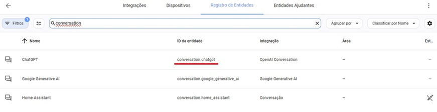
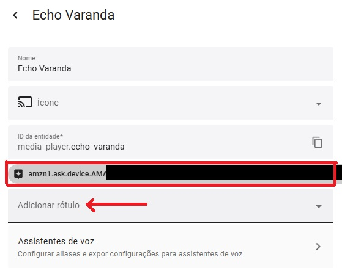

## INSTALLATION

### Setting up Home Assistant
- Enable the Home Assistant API for your user and obtain a long-lived access token.

### Creating the Alexa Skill
1. Create a Skill in the [Alexa Developer Console](https://developer.amazon.com/alexa/console/ask) by following the steps below:
   - **Name your Skill**: Choose a name of your preference (e.g., Home Assistant Assist)
   - **Choose a primary locale**: Portuguese (BR)
   - **Experience Type**: Other > Custom > Alexa-hosted (Python)
   - **Hosting region**: You can leave the default (US East (N. Virginia))
   - **Templates**: Click on Import Skill
   - **Insert the address**: [https://github.com/fabianosan/skill-alexa-chatgpt4-assistpipeline-HomeAssistant.git](https://github.com/fabianosan/skill-alexa-chatgpt4-assistpipeline-HomeAssistant.git)

   - **Name your Skill**: Choose a name of your preference (e.g., Home Assistant Assist)
   - **Choose a primary locale**: Portuguese (BR)
   - **Choose a type of experience**: Other
   - **Choose a model**: Custom
   - **Hosting services**: Alexa-hosted (Python)
   - **Hosting region**: US East (N. Virginia) is the default, but you must use the same region where you created the AWS account and configured IAM [Instructions here](https://www.home-assistant.io/integrations/alexa.smart_home)
   - **Templates**: Click on `Import skill`
   - **Insert the address**: [https://github.com/fabianosan/HomeAssistantAssist.git](https://github.com/fabianosan/HomeAssistantAssist.git) and click `Import`
2. Go to the **Code** tab.
3. Insert your information into the `config.txt` file as instructed below:
   - Open the `config.txt` file in the project's root directory (/Skill Code/lambda/).
   - Insert the following information:
     ```txt
     home_assistant_url=https://YOUR-HOME-ASSISTANT-EXTERNAL-URL/api/conversation/process
     home_assistant_token=YOUR-HOME-ASSISTANT-TOKEN
     home_assistant_agent_id=YOUR-AGENT-ID
     home_assistant_language=pt-BR
     home_assistant_api_timeout=30
     home_assistant_dashboard=YOUR-DASHBOARD-ID
     home_assistant_kioskmode=False
     ```
   - **home_assistant_url**: External URL of your Home Assistant conversation API.
   - **home_assistant_token**: Long-lived access token of your Home Assistant.
   - **home_assistant_agent_id**: ID of the conversation agent configured in your Home Assistant.
   - **home_assistant_language**: Language to call the Home Assistant conversation API.
   - **home_assistant_dashboard**: Path of the dashboard to display on Echo Show, e.g., lovelace.
   - **home_assistant_kioskmode**: Enable kiosk mode with `True`, but only activate if you have the component installed in your Home Assistant.
4. Still in the configuration file, adjust the phrases as you wish and translate them if necessary to the chosen language.
5. Save the changes.
6. Click `Deploy`.

### Setting the ``Invocation Name``
- The default invocation name set in the code is "smart house."
- To change the invocation name:
  1. Go to the **Build** tab.
  2. Click on `Invocations` and then on `Skill Invocation Name`.
  3. Enter the desired new invocation name and save the changes (test if this wake word can be used in the **Test** tab).
  4. Rebuild the model by clicking on `Build skill` if you make changes.

### Getting the `home_assistant_agent_id` from Assist or the generative AI (if you are using one, like Google AI or OpenAI):
- The `agent_id` is the ID of the generative AI entity:
  1. Go to **Settings** > **Devices & Services** > **Integrations** > **OpenAI Conversation** or **Google Generative AI** and you will see "1 service and 1 entity," click on the entity, and the entity will be displayed in the **Entity ID** column.
    
  
### Publishing the Skill
1. After deploying the code in the **Code** tab, return to the **Build** tab and click on **Build skill**.
2. Then go to the **Alexa** app on your phone: `More` > `Skills & Games` > scroll to the bottom and click on `Your Skills` > `Dev.`, click on the skill you just created and **activate** it.

    
    
3. Go back to the ``Alexa Developer Console`` and test the Skill in the **Test** tab to ensure the wake word and skill are working correctly.

### Enabling automatic area recognition (if you are using AI in Assist)
- The skill sends the device ID (which is running the skill) in the conversation API call of the Home Assistant, so with a command to the AI and a label on the device, the AI can associate the received device ID with the device and locate in which area it is. To do this, follow the steps below:
  1. Enable conversation API debug logging by adding the following configuration in the Home Assistant `configuration.yaml` file:
  - Insert the following information:
     ```txt
     logger:
       logs:
         homeassistant.components.conversation: debug
     ```
  2. Restart Home Assistant, start the skill on the desired Echo device, and give any command. The log will appear as below:
    ```txt
    2024-10-10 11:04:56.798 DEBUG (MainThread) [homeassistant.components.conversation.agent_manager] Processing in pt-BR: turn on the living room light. device_id: amzn1.ask.device.AMA***
    ```
     Or you can get the same device ID from the "device: " log in the ``Alexa Developer Console`` under ``CloudWatch`` if you know how to access it.
  3. Take the entire identifier that appears after the device_id, e.g., `amzn1.ask.device.AMA***`, and add a new label to the **Echo device** via the `Alexa Media` Integration:
    
  4. Update the **AI command prompt** of your choice with the following command:
     ```txt
     If asked to perform an action and no area is specified for the device, use the label received in the command after the string "device_id:" to find the entity associated with the label and use that entity's area to execute the command.
     ```

### Good luck!
Now you can use your Alexa skill to integrate and interact with Home Assistant via voice using Assist or open your favorite dashboard on the Echo Show.
If you enjoyed it, remember to send a **Thank You** to the developers.

<details><summary>Credits</summary>
<p>   
For [rodrigoscoelho](https://github.com/rodrigoscoelho), who started the development of this skill.
</p>
</details>