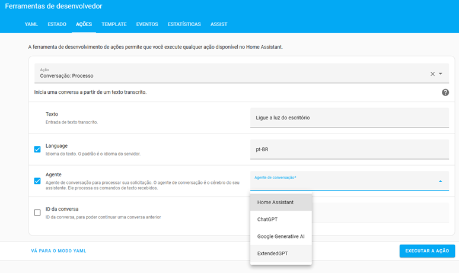
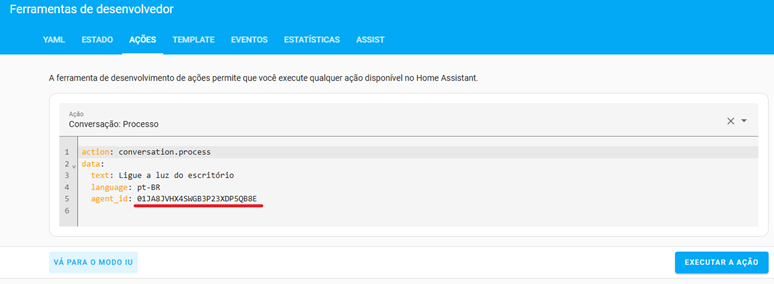
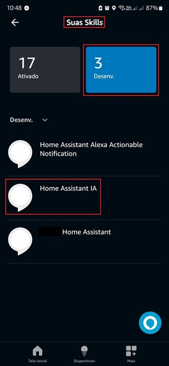
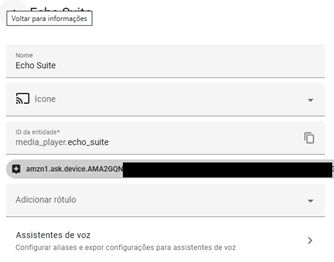

## INSTALAÇÃO

### Configurando o Home Assistant
- Ative a API do Home Assistant para seu usuário e obtenha um token de acesso de longa duração.

### Criando a Skill Alexa
1. Crie uma Skill na [Alexa Developer Console](https://developer.amazon.com/alexa/console/ask) seguindo os passos abaixo:
   - **Name your Skill**: Escolha um nome de sua preferência (Ex: Home Assistant Assist)
   - **Choose a primary locale**: Portuguese (BR)
   - **Tipo de experiência**: Other > Custom > Alexa-hosted (Python)
   - **Hosting region**: Pode deixar o padrão (US East (N. Virginia))
   - **Templates**: Clique em Import Skill
   - **Insira o endereço**: [https://github.com/fabianosan/skill-alexa-chatgpt4-assistpipeline-HomeAssistant.git](https://github.com/fabianosan/skill-alexa-chatgpt4-assistpipeline-HomeAssistant.git)

   - **Name your Skill**: Escolha um nome de sua preferência (Ex: Home Assistant Assist)
   - **Choose a primary locale**: Portuguese (BR)
   - **Choose a type of experience**: Other
   - **Choose a model**: Custom
   - **Hosting services**: Alexa hosted (Python)
   - **Hosting region**: US East (N. Virginia) é o padrão, mas é necessário utilizar a mesma região onde criou a conta na AWS e configurou o IAM [Instruções aqui](https://www.home-assistant.io/integrations/alexa.smart_home)
   - **Templates**: Clique em ``Import skill``
   - **Insert the address**: [https://github.com/fabianosan/HomeAssistantAssist.git](https://github.com/fabianosan/HomeAssistantAssist.git) e clique ``Import``
2. Vá na aba **Code**
3. Insira suas informações no arquivo `config.txt` conforme instruções abaixo:
   - Abra o arquivo `config.txt` no diretório raiz do projeto (/Skill Code/lambda/).
   - Insira as seguintes informações:
     ```txt
     home_assistant_url=https://SUA-URL-EXTERNA-DO-HOME-ASSISTANT/api/conversation/process
     home_assistant_token=SEU-TOKEN-DO-HOME-ASSISTANT
     home_assistant_agent_id=SEU-AGENT-ID
     home_assistant_language=pt-BR
     home_assistant_room_recognition=False
     home_assistant_dashboard=ID-SEU-DASHBOARD
     home_assistant_kioskmode=False
     ```
   - **home_assistant_url**: URL externa da API de conversação do seu Home Assistant.
   - **home_assistant_token**: Token de acesso de longa duração do seu Home Assistant.
   - **home_assistant_agent_id**: ID do agente de conversação configurado no seu Home Assistant.
   - **home_assistant_language**: Idioma para chamar a API de conversação do Home Assistant.
   - **home_assistant_kioskmode**: Ative o modo identificação de área com `True`, mas cuidado, essa configuração só funciona com IA, aumenta o tempo de resposta e precisa configurações adicionais no seu Home Assistant, bem como no prompt da IA para entender como fazer essa busca (detalhes abaixo).
   - **home_assistant_dashboard**: Caminho do dashboard para exibir na echoshow, ex.: lovelace
   - **home_assistant_kioskmode**: Ative o modo quisque com `True`, mas só ative se tiver o componente instalado no seu Home Assistant.
4. Ainda no arquivo de configurações, altere as frases conforme sua vontade e se necessário traduza para o idioma escolhido.
5. Salve as alterações.
6. Clique em `Deploy`.

### Configurando o ``Invocation Name``
- O nome de invocação padrão configurado no código é "casa inteligente".
- Para alterar o nome de invocação:
  1. Vá para a aba **Build**.
  2. Clique em `Invocations` e depois em `Skill Invocation Name`.
  3. Insira o novo nome de invocação desejado e salve as alterações (teste se essa palavra de ativação pode ser usada na aba de **Test**).
  4. Dê rebuild do modelo clicando `Build skill` se alterar.

### Obtendo o `home_assistant_agent_id` do Assist ou da IA generativa (se estiver utilizando uma):
- Navegue até a **Ferramentas de Desenvolvedor**, vá na aba `Ações` e siga os passos abaixo: 
  1. Busque por `conversation.process` no campo de ações e selecione:

    

  2. Ative o campo `Agente` e selecione o agente de conversação desejado na lista:

    

  1. Alterne para o `MODO YAML` e copie o ID que está no campo `agent_id`:

    
  
### Publicando a Skill
1. Após fazer o deploy do código na aba **Code**, volte para aba **Build** e clique em **Build skill**.
2. Depois vá no aplicativo **Alexa** em seu celular e vá em: `Mais` > `Skills e jogos` > deslize a tela até o fim e clique em `Suas Skills` > `Desenv.`, clique na skill que você acabou de criar e **ative**

    
    

3. Volte no console da ``Alexa Developer Console`` e teste a Skill na aba **Test** para garantir que a palavra de ativação e a skill estão funcionando corretamente.

### Ativando o reconhecimento de área automático (se estiver utilizando IA no Assist)
- A skill envia o device id (que está executando a skill) na chamada da API de conversação do Home Assistant, então com uma instrução de comando para a IA e um rótulo no dispositivo, a IA consegue associar o identificador dos dispositivo recebido ao dispositivo e localizar em qual área ele está, para isso, siga os passos abaixo:
  1. Ative o log de debug da API de conversação adicionando a seguinte configuração no `configuration.yaml` do Home Assistant:
  - Insira a seguinte informação:
     ```txt
     logger:
       logs:
         homeassistant.components.conversation: debug
     ```
  2. Reinicie o Home Assistant, inicie a skill pelo dispositivo echo desejado e dê qualquer comando, o log irá aparecer como abaixo:
    ```txt
    2024-10-10 11:04:56.798 DEBUG (MainThread) [homeassistant.components.conversation.agent_manager] Processing in pt-BR: ligue a luz da sala. device_id: amzn1.ask.device.AMA***
     ```
     Ou você pode obter esse mesmo ID no log "device: " pela ``Alexa Developer Console`` em ``Cloud Watch`` se souber como fazê-lo.
  3. Pegue todo o identificador que estiver após o device_id, ex.: `amzn1.ask.device.AMA***` e adicione um novo rótulo no **dispositivo echo** pela Integração `Alexa Media`:
  
    
    
  4. Atualize o **prompt de comando da IA** de sua preferência com o comando abaixo:
     ```txt
     Se solicitado para executar alguma ação e não informar a área do dispositivo, use o rótulo recebido no comando após a string "device_id:" para encontrar a entidade associada ao rotulo e use a área dessa entididade para executar o comando.
     ```

### Boa sorte!
Agora você pode usar sua skill Alexa para integrar e interagir com o Home Assistant via Assist por voz ou abrir a tela do seu dashboard preferido na Echoshow.
Se gostou, lembre-se de mandar um **Obrigado** para os desenvolvedores.

<details><summary>Créditos</summary>
<p>   
Para o [rodrigoscoelho](https://github.com/rodrigoscoelho), quem iniciou o desenvolvimento desta skill.
</p>
</details>